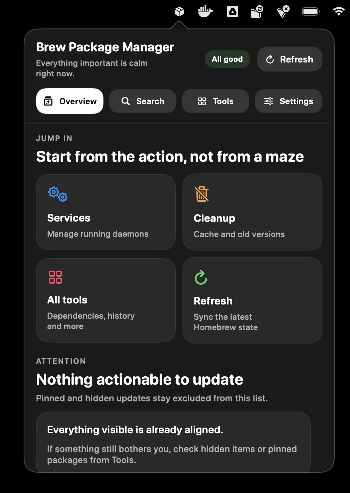
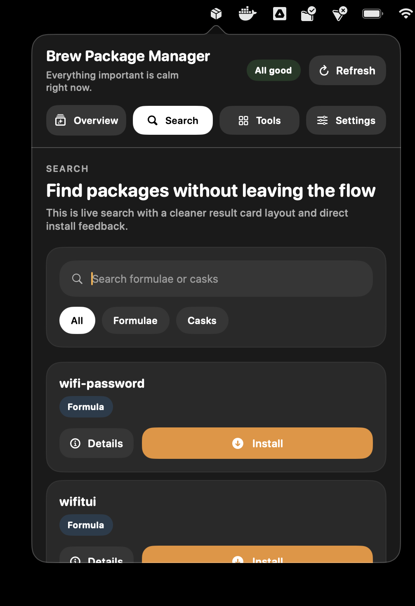
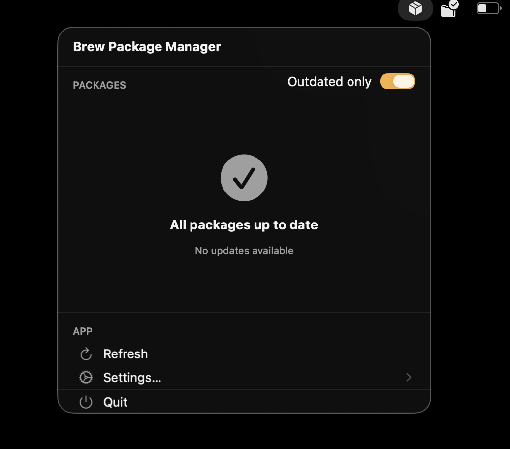
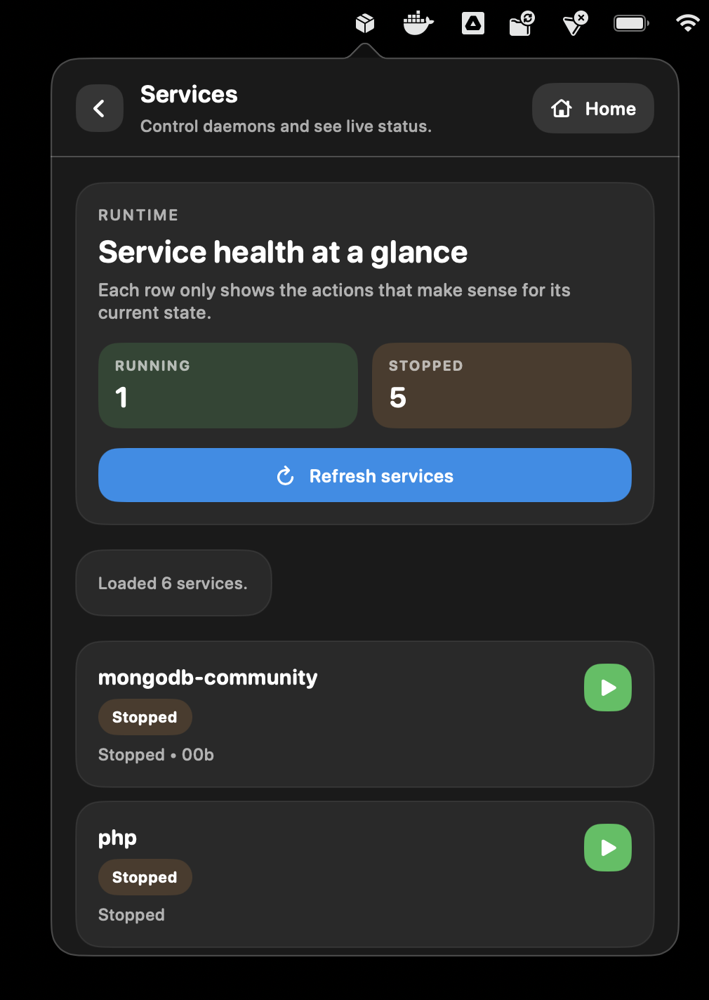
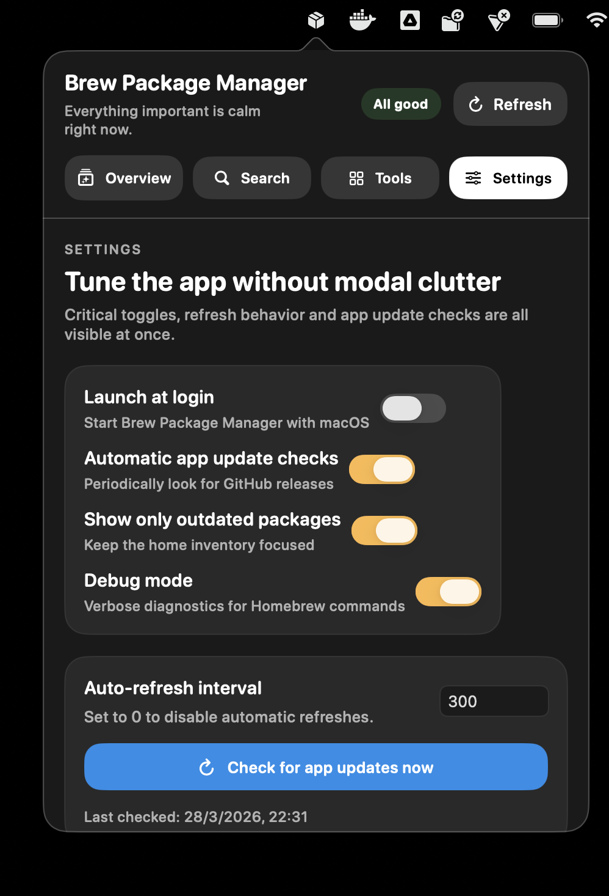

<div align="center">


# BrewPackageManager

### Native macOS Menu Bar App for Homebrew Package Management

[](https://www.apple.com/macos/)
[](https://swift.org)
[](LICENSE)

A modern, native macOS menu bar application for managing Homebrew packages. Built with Swift and SwiftUI for macOS 15.0+.

[Features](#features) •
[Screenshots](#screenshots) •
[Installation](#installation) •
[Usage](#usage) •
[Documentation](#documentation) •
[Development](#development)

</div>

---

## Screenshots

<div align="center">

### Main Interface


### Package Search


### Package Updates


### Services Management


### Settings Panel


</div>

---

## Features

### Package Search & Installation

Discover and install new Homebrew packages directly from the menu bar application without using the terminal.

- **Package Search**: Search for available Homebrew packages (both formulae and casks)
- **Type Filtering**: Filter results by package type (All, Formulae only, or Casks only)
- **Quick Installation**: Install packages with a single click and confirmation dialog
- **Installation Progress**: Real-time progress indicators showing installation status
- **Package Details**: View package descriptions and metadata before installing
- **Smart Results**: First 15 results displayed with hints for refining search

### Launch at Login

Optionally configure the app to launch automatically when you log in to macOS.

- **System Integration**: Uses native macOS login items via ServiceManagement framework
- **Easy Toggle**: Enable/disable from Settings → General section
- **Persistent Setting**: Choice is remembered and managed by the system

### Automatic Updates

Stay up to date with the latest features and improvements.

- **GitHub Integration**: Automatically checks for new releases from the official repository
- **Smart Timing**: Checks once per 24 hours to avoid excessive network requests
- **Update Notifications**: Alert dialog shows version details and release notes
- **User Control**:
  - Toggle automatic checking on/off
  - Manual "Check Now" button
  - Skip specific versions permanently
  - Postpone updates with "Remind Me Later"
- **Privacy Friendly**: Only connects to GitHub API, no analytics or tracking

### Services Manager

Control Homebrew services directly from the menu bar.

- **Service Control**: Start, stop, and restart Homebrew services
- **Real-time Status**: Live status indicators (Running, Stopped, Error)
- **Service Information**: View PID, user, and plist path for each service
- **Summary Statistics**: Running vs stopped services count
- **Thread-safe Operations**: Actor-based architecture prevents race conditions

### Cleanup & Cache Management

Optimize disk space by managing Homebrew's cache and old versions.

- **Cache Analysis**: View cache size and file count
- **Old Versions Detection**: Identify outdated formula versions
- **Two Cleanup Modes**:
  - Clean old versions only
  - Clear entire download cache with `--prune=all`
- **Smart Recommendations**: Alerts when cache exceeds 500 MB or >5 old versions
- **Size Reporting**: Shows freed disk space after cleanup

### Dependencies Management

Visualize and understand package dependencies.

- **Dependency Viewer**: See all dependencies for installed packages
- **Search Filter**: Quick package lookup
- **Dependency Types**:
  - Direct dependencies
  - Optional dependencies
  - Build-only dependencies
  - Reverse dependencies (what uses this package)
- **Summary Statistics**: Total packages and dependencies count
- **Visual Indicators**: Color-coded status for independent and required packages

### History & Statistics

Track your Homebrew usage and operations over time.

- **Operation History**:
  - Persistent log of all operations (install, upgrade, uninstall, services, cleanup)
  - Chronological display with relative timestamps
  - Filter by operation type
  - Success/failure indicators
  - Stores up to 1000 most recent entries

- **Usage Statistics**:
  - Total operations count and success rate
  - Operations breakdown by type with visual bars
  - Most installed packages (top 10)
  - Most upgraded packages (top 10)
  - Interactive statistics cards

### Package Management

The core functionality revolves around providing visibility into your Homebrew installation. The app automatically detects both formulae (command-line tools) and casks (GUI applications) installed on your system.

- **Installed Package Listing**: View all packages installed via Homebrew with detailed version information
- **Update Detection**: Continuously monitors for outdated packages with visual indicators
- **Bulk Update Operations**: Select multiple packages using checkboxes and update them in a single operation
- **Package Information**: View detailed information including description, homepage, license, and release notes
- **Uninstall Packages**: Right-click context menu for easy package removal

### Export Functionality

Export your complete Homebrew inventory to CSV format for documentation, auditing, or backup purposes.

The exported CSV file contains:
- Name and full package name
- Type (formula or cask)
- Version information (installed vs current)
- Outdated status
- Tap source
- Description and homepage

### Auto-Refresh

Configurable auto-refresh keeps package information current without manual intervention. Set a custom interval in seconds, and the app will automatically query Homebrew for updates.

### Display Options

- **Filter Mode**: Show only outdated packages to reduce visual clutter
- **Debug Mode**: Enable verbose logging for troubleshooting
- **Dark Mode Support**: Fully integrated with macOS appearance settings

---

## Requirements

- macOS 15.0 or later
- Homebrew installed at standard paths:
  - `/opt/homebrew/bin/brew` (Apple Silicon)
  - `/usr/local/bin/brew` (Intel)

---

## Installation

### Download DMG

Download the latest release DMG from the [releases page](https://github.com/686f6c61/BrewPackageManager/releases).

1. Open the DMG file
2. Drag **BrewPackageManager.app** to the Applications folder
3. Launch from Applications

### Build from Source

Requires Xcode 16.0+ with Swift 6 support:

```bash
git clone https://github.com/686f6c61/BrewPackageManager.git
cd BrewPackageManager
./create-dmg.sh
```

The DMG will be created at `dmg/BrewPackageManager-1.8.0.dmg`.

> **Note**: This app requires App Sandbox to be disabled to execute Homebrew commands. The build script handles this automatically.

---

## Usage

### Basic Operations

After launching, the app icon appears in your menu bar. The icon changes to reflect the current state:

- Cube icon: Normal state, all packages up to date
- Cube with badge: Updates available
- Rotating arrows: Refresh in progress
- Arrow up circle: Update operation running

Click the menu bar icon to open the package manager interface.

### Updating Packages

1. Click checkboxes next to outdated packages to select them
2. Or use "Select All Outdated" to select all at once
3. Click "Update Selected" to begin the upgrade process
4. Progress indicator shows current operation and completion status

Pinned formulae are shown with a pin icon and skipped during bulk updates. To update one, run `brew unpin <name>` first.

### Exporting Package Data

1. Navigate to **Settings** from the main menu
2. Click **Export to CSV**
3. Choose save location (default: `homebrew-packages.csv`)

### Configuring Auto-Refresh

1. Open **Settings**
2. Adjust "Refresh interval" in seconds
3. Set to 0 to disable auto-refresh
4. Minimum effective interval is 10 seconds

### Viewing Package Details

Click the info button next to any package to view:
- Package description and metadata
- Installed and available versions
- License information
- Links to homepage, release notes, and GitHub repository

### Uninstalling Packages

Right-click on any package and select **Uninstall** from the context menu.

---

## Architecture

### Technology Stack

- **Swift 6**: Modern Swift with strict concurrency
- **SwiftUI**: Declarative UI framework
- **Observation**: State management with @Observable macro
- **AppKit**: Native macOS integration
- **OSLog**: Structured logging

### Project Structure

```
BrewPackageManager/
├── Brew/              # Homebrew interaction & JSON parsing
├── Shell/             # Command execution infrastructure
├── Packages/          # State management & business logic
├── MenuBar/           # SwiftUI views & navigation
├── Settings/          # User preferences management
├── Updates/           # GitHub updates integration
├── Services/          # Homebrew services management
├── Cleanup/           # Cache & cleanup operations
├── Dependencies/      # Dependency analysis
├── History/           # Operation history & statistics
├── Design/            # Reusable UI components & modifiers
├── Components/        # Generic UI elements
└── Utilities/         # Helper functions & bridges
```

### Concurrency Model

- **BrewPackagesClient**: Actor ensuring serial Homebrew operations
- **PackagesStore**: @MainActor for UI updates on main thread
- Asynchronous pipe reading prevents deadlocks with large outputs
- Background tasks with utility priority for cache operations

### Error Handling

Custom `AppError` enum captures common failure modes:
- Homebrew not found
- Command execution failures
- JSON decoding errors
- Operation timeouts
- User cancellation

---

## Documentation

Full documentation for contributors and maintainers is available in the `docs/` folder:

- [Docs Index](docs/README.md)
- [App Overview](docs/APP_OVERVIEW.md)
- [Architecture](docs/ARCHITECTURE.md)
- [Module Reference](docs/MODULE_REFERENCE.md)
- [Runtime Workflows](docs/WORKFLOWS.md)
- [Development Guide](docs/DEVELOPMENT_GUIDE.md)
- [Testing Strategy](docs/TESTING_STRATEGY.md)
- [Release Playbook](docs/RELEASE_PLAYBOOK.md)
- [Community Developer Plan](docs/COMMUNITY_DEV_PLAN.md)

---

## Development

### Building from Source

Ensure you have Xcode 16.0+ installed with Command Line Tools:

```bash
xcodebuild \
    -project BrewPackageManager.xcodeproj \
    -scheme BrewPackageManager \
    -configuration Debug \
    ENABLE_APP_SANDBOX=NO \
    build
```

Swift strict concurrency is set to "minimal" to avoid false positives from JSONDecoder conformance issues.

### Code Style

- Explicit `self` only when required
- Prefer `let` over `var`
- Trailing closure syntax for single parameters
- Group functionality with `// MARK:` comments
- Descriptive variable names conveying intent

### Testing

Manual testing scenarios:
- Fresh install with no cached data
- Large package lists (100+ packages)
- Slow network conditions
- Homebrew not installed
- Concurrent update operations
- Settings persistence
- CSV export with special characters

### Contributing

Contributions welcome! Please ensure:
- Code compiles without warnings in Swift 6 mode
- Follows existing patterns and style
- Clear commit messages
- Manual testing against real Homebrew
- Documentation updates for user-facing changes

---

## Homebrew Commands

The application uses Homebrew's JSON API:

```bash
# Package Management
brew info --json=v2 --installed        # List all installed packages
brew outdated --json=v2                 # Check for outdated packages
brew info --json=v2 <package>          # Get detailed package info
brew upgrade <package>                  # Upgrade specific package
brew upgrade                            # Upgrade all packages
brew uninstall <package>                # Uninstall package

# Services Management
brew services list --json               # List all services with status
brew services start <service>           # Start a service
brew services stop <service>            # Stop a service
brew services restart <service>         # Restart a service

# Cleanup & Cache
brew cleanup --dry-run -s               # Preview cleanup operations
brew cleanup -s                         # Cleanup old versions
brew cleanup --prune=all                # Clear download cache
brew --cache                            # Get cache directory path

# Dependencies
brew info --json=v2 <package>          # Get dependency information
brew uses --installed <package>         # Get reverse dependencies
brew list --formula                     # List installed formulae

# Search
brew search --json=v2 <query>          # Search for packages
```

Environment variables prevent unwanted side effects:
```bash
HOMEBREW_NO_AUTO_UPDATE=1
HOMEBREW_NO_INSTALL_CLEANUP=1
```

---

## Credits

This project builds upon infrastructure from [BrewServicesManager](https://github.com/validatedev/BrewServicesManager) by validatedev (MIT License).

Reused components:
- Command execution system
- Design system (modifiers, gradients, layout constants)
- Generic UI components

The package management logic, state management, CSV export, and UI layout are original implementations.

**Icon**: [Icons8 Box Icon](https://icons8.com)

---

## License

MIT License

Copyright (c) 2026

Permission is hereby granted, free of charge, to any person obtaining a copy
of this software and associated documentation files (the "Software"), to deal
in the Software without restriction, including without limitation the rights
to use, copy, modify, merge, publish, distribute, sublicense, and/or sell
copies of the Software, and to permit persons to whom the Software is
furnished to do so, subject to the following conditions:

The above copyright notice and this permission notice shall be included in all
copies or substantial portions of the Software.

THE SOFTWARE IS PROVIDED "AS IS", WITHOUT WARRANTY OF ANY KIND, EXPRESS OR
IMPLIED, INCLUDING BUT NOT LIMITED TO THE WARRANTIES OF MERCHANTABILITY,
FITNESS FOR A PARTICULAR PURPOSE AND NONINFRINGEMENT. IN NO EVENT SHALL THE
AUTHORS OR COPYRIGHT HOLDERS BE LIABLE FOR ANY CLAIM, DAMAGES OR OTHER
LIABILITY, WHETHER IN AN ACTION OF CONTRACT, TORT OR OTHERWISE, ARISING FROM,
OUT OF OR IN CONNECTION WITH THE SOFTWARE OR THE USE OR OTHER DEALINGS IN THE
SOFTWARE.

---

## Author

Created by [686f6c61](https://github.com/686f6c61)

---

## Support

For bugs, feature requests, or questions, please open an issue on the [GitHub repository](https://github.com/686f6c61/BrewPackageManager).

When reporting bugs, include:
- macOS version
- Homebrew version (`brew --version`)
- Number of installed packages
- Steps to reproduce
- Relevant logs from Console.app if available

---

<div align="center">

Made with care for the Homebrew community

[Back to top](#brewpackagemanager)

</div>
