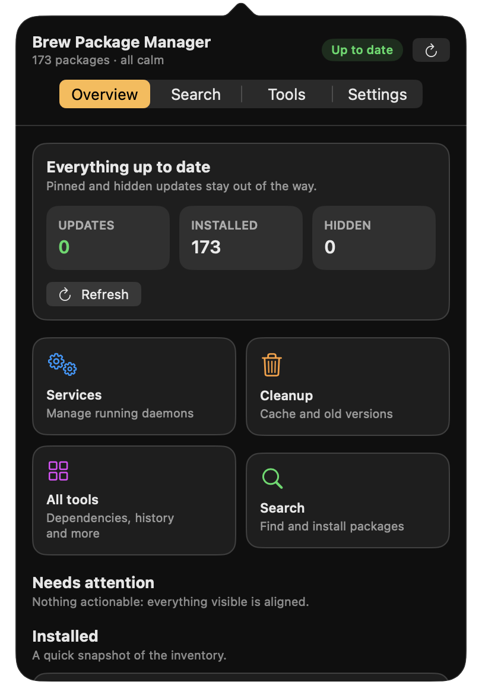
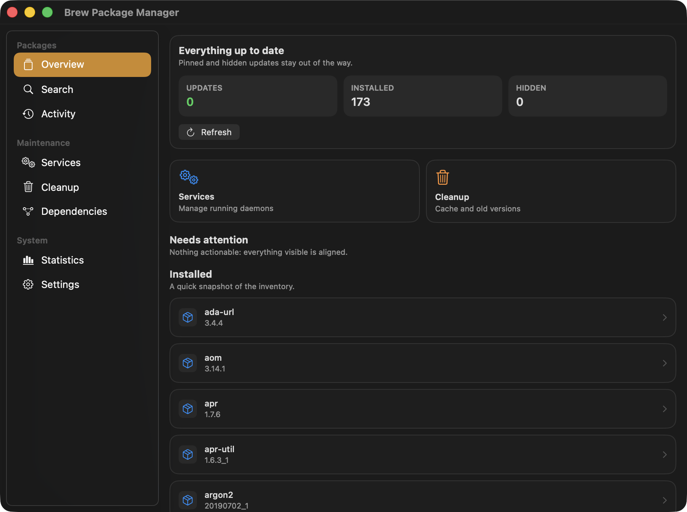
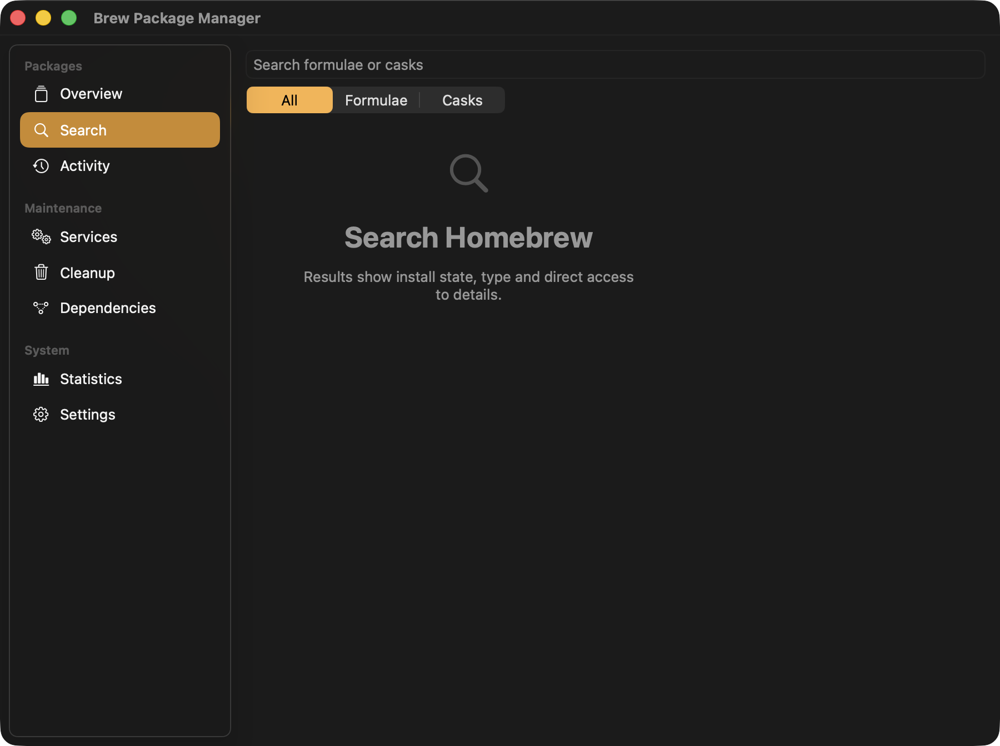
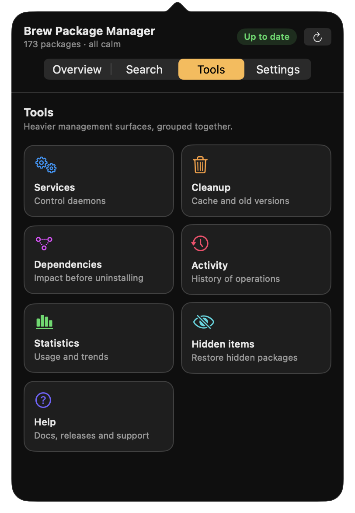
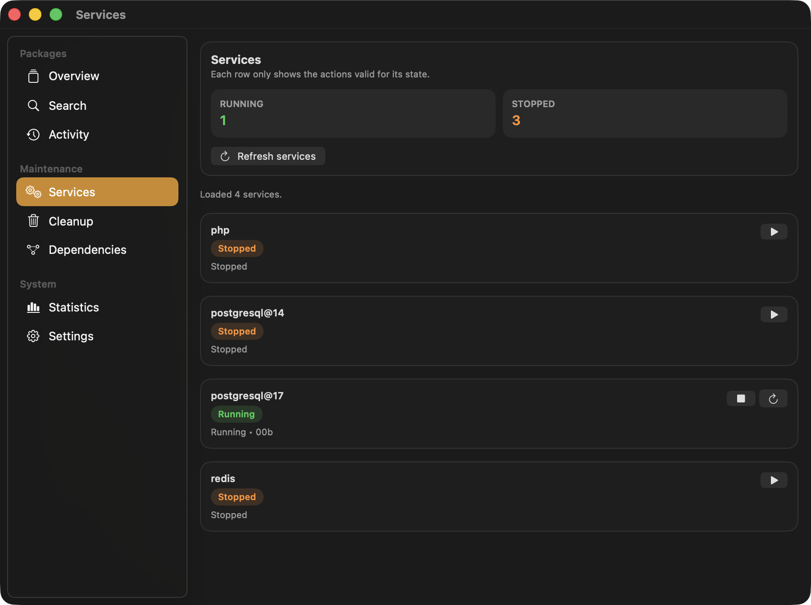
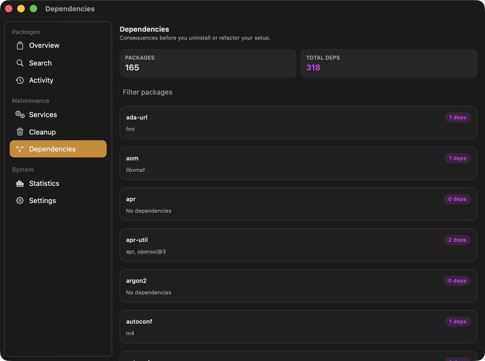
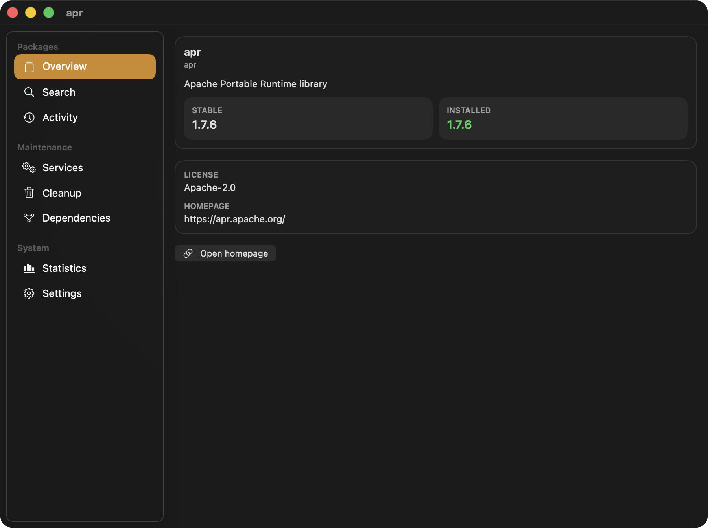
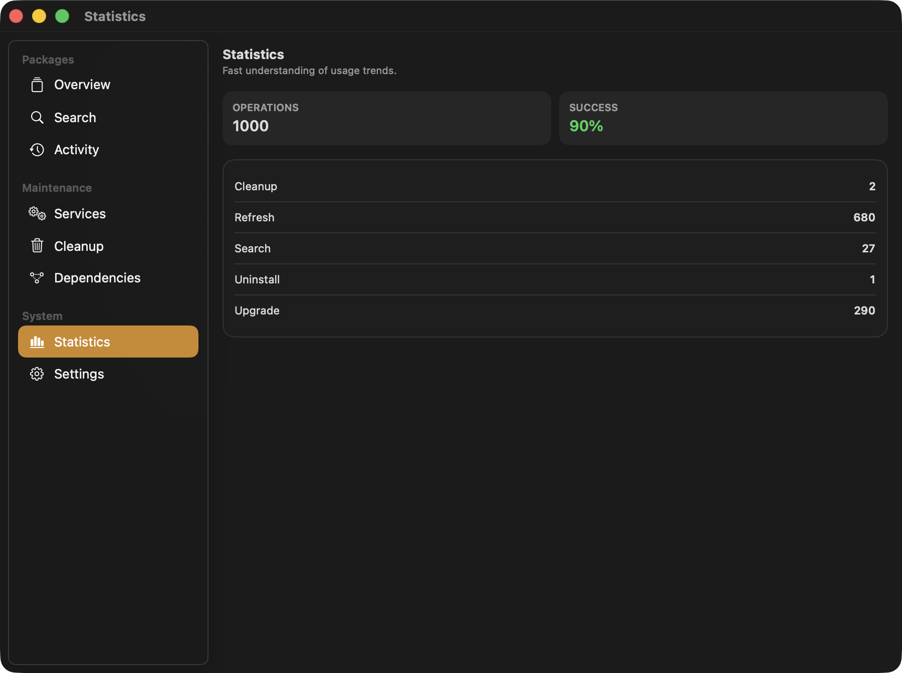
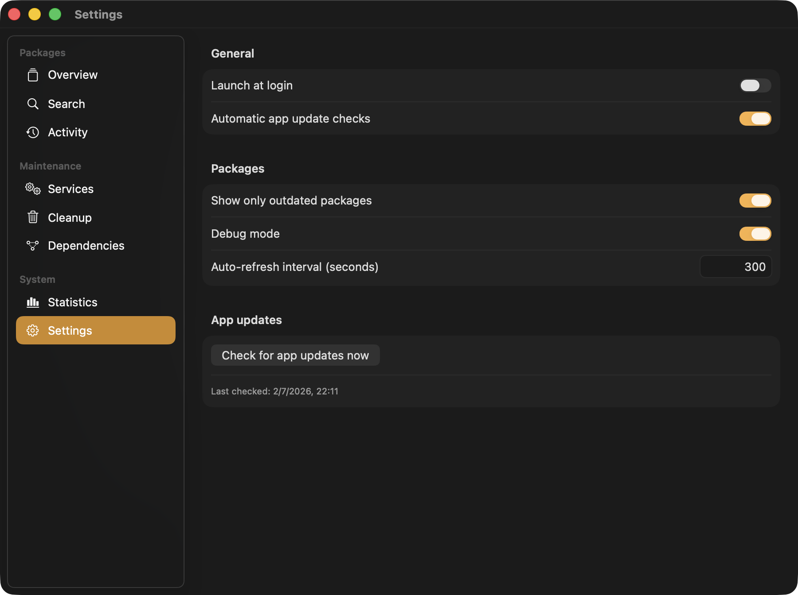

<div align="center">


# BrewPackageManager

### Native macOS Menu Bar App for Homebrew, rebuilt for 2.0

[](https://www.apple.com/macos/)
[](https://swift.org)
[](LICENSE)

BrewPackageManager is a native macOS menu bar companion for Homebrew that turns package maintenance, search, cleanup, diagnostics, and service management into a fast, readable desktop workflow instead of a collection of terminal commands.

The 2.0 line rebuilds the experience around a cleaner operational shell, clearer state feedback, and direct access to the actions people actually repeat: checking what needs attention, updating visible packages, installing something new, inspecting dependencies, and troubleshooting command results without losing context.

[Features](#features) •
[Screenshots](#screenshots) •
[Installation](#installation) •
[Usage](#usage) •
[Documentation](#documentation) •
[Development](#development)

</div>

---

## Screenshots

<div align="center">

### Overview


### Main Flow


### Package Search


### Tools


### Services Management


### Dependencies


### Package Detail


### Statistics


### Settings Panel


</div>

---

## Features

### 2.0 Shell

The 2.0 line replaces the old menu layout with a new operational shell focused on four primary areas:

Instead of mixing every feature into one overloaded popover, the shell groups the app around a few stable mental models. The goal is simple: the main view should help you decide what matters now, while the deeper tools stay easy to reach without polluting the core flow.

- **Overview**: actionable updates, installed inventory snapshot, hidden items count, and fast-entry actions
- **Search**: live package search with filters and direct install/detail actions
- **Tools**: services, cleanup, dependencies, history, statistics, hidden items, and help in one deliberate place
- **Settings**: core runtime toggles, refresh interval, debug mode, and app update checks

Each of those areas is meant to answer a different question. `Overview` is for action, `Search` is for discovery, `Tools` is for deeper management work, and `Settings` is for changing how the app behaves over time.

### Package Management

Package management is still the center of the app, but 2.0 makes a stronger distinction between what is installed, what is outdated, and what is actually actionable. That matters because Homebrew setups often contain pinned packages, hidden updates, or items you want to keep around without turning them into constant visual noise.

- **Installed Package Visibility**: installed Homebrew packages with version and update state
- **Visible Update Count**: pinned and hidden updates are excluded from the main action count
- **Bulk Update Action**: update all visible packages from the overview flow
- **Package Details**: inspect metadata, versions, homepage, and release links
- **Pinned Guidance**: pinned formulae stay visible as state, but are not treated as actionable updates
- **Hidden Items**: hide noisy packages or updates and restore them later

In practice, this means the UI tries to stay honest. If something cannot be updated because it is pinned, the app should treat that as context, not as a broken action. If something is intentionally hidden, it should disappear from the main flow but still remain recoverable.

### Search and Install

Search is designed for quick package discovery without leaving the menu bar flow. Instead of a one-shot input that forces an extra confirmation step, the search experience reacts while you type and keeps install and detail actions close to the result itself.

- **Live Search**: search runs as you type
- **Type Filters**: All, Formulae, or Casks
- **Direct Install**: install packages from search results
- **Details Flow**: open package details without losing the surrounding navigation context

This makes the screen useful both for fast installs and for cautious inspection. You can scan the result set, narrow by package type, open a package first, and only then install if it looks right.

### Services

Homebrew services are one of the places where a GUI can save real time, especially when you are juggling local databases, queues, or background daemons. The app tries to surface the status of each service clearly enough that you can understand what is running before you touch anything.

- **Service Control**: start, stop, and restart Homebrew services
- **Status Summary**: running and stopped counts at the top of the screen
- **Row-Level Feedback**: each service shows only valid actions for its current state
- **Metadata Visibility**: service status, PID, and summary data stay readable in one card

The important part is not only that the action exists, but that the result is legible. A service screen should tell you whether something is running, who owns it, and what action makes sense next, instead of forcing you to infer that from raw command output.

### Cleanup and Cache

Cleanup is intentionally split because Homebrew cleanup work is not all the same. Clearing the download cache, removing old package versions, and uninstalling packages are different actions with different consequences, and the UI should not blur them together.

- **Separated Actions**: cache clearing and old-version cleanup are explicitly different flows
- **Immediate Cache Clear**: clearing download cache does not ask for confirmation first
- **Old Versions Cleanup**: destructive package-version cleanup still requires confirmation
- **Result Messaging**: cleanup feedback explains what was cleared and what remains

That separation is there to reduce anxiety and avoid false expectations. If you clear cache, the app should say exactly that. If old versions remain, the app should say that too instead of making the user guess whether the action failed.

### History and Diagnostics

When Homebrew behaves unexpectedly, the problem is rarely just “something failed.” Usually you need context: what command ran, whether it timed out, whether it was cancelled, what happened previously, and whether the app still has a sane internal state. This part of the app is there to make that debugging path much shorter.

- **Persistent History**: operations are recorded for later inspection
- **Statistics View**: high-level counts and success-rate summary
- **Command Diagnostics**: debug mode keeps command output and metadata easier to reason about
- **GitHub Release Checks**: manual and automatic app update checks against releases

This is especially useful when a workflow breaks after a Homebrew update. Instead of jumping immediately into guesswork, you can inspect what the app saw, what it tried to do, and where the failure surfaced.

---

## Terminology

Homebrew uses two package families:

Those names come directly from Homebrew itself, so they appear in command output, JSON payloads, and the app UI. If you do not work with Homebrew terminology every day, it helps to map them to more familiar product language.

- **Formulae**: CLI tools, libraries, and developer packages such as `tree`, `wget`, or `python`
- **Casks**: macOS apps and app-like binaries such as `visual-studio-code`, `google-chrome`, or `slack`

If you prefer user-facing wording, think of them as:

- **CLI Tools** = Formulae
- **Mac Apps** = Casks

---

## Requirements

The app targets a modern macOS setup and expects a standard Homebrew installation. It is intentionally opinionated here because predictable paths and a current toolchain make both runtime behavior and contributor support much more reliable.

- macOS 15.0 or later
- Homebrew installed at one of the standard paths:
  - `/opt/homebrew/bin/brew` (Apple Silicon)
  - `/usr/local/bin/brew` (Intel)
- Xcode 26+ if you want to build from source with the same Swift 6.3 toolchain used in the current audit
- Docker 29+ if you want to run the external audit lane locally

---

## Installation

### Download DMG

Download the latest release DMG from the [releases page](https://github.com/686f6c61/BrewPackageManager/releases).

This is the simplest path if you only want to install and use the app. The DMG is meant to behave like a normal macOS distribution: drag, drop, open, and start using the menu bar extra.

1. Open the DMG file
2. Drag **BrewPackageManager.app** to the Applications folder
3. Launch from Applications

### Build from Source

```bash
git clone https://github.com/686f6c61/BrewPackageManager.git
cd BrewPackageManager
./create-dmg.sh
```

The DMG will be created at `dmg/BrewPackageManager-2.0.0.dmg`.

Building from source is the better route if you want to inspect the code, test the new shell, or iterate on the app locally before packaging a release.

> App Sandbox must be disabled for local builds and releases because the app needs to execute `brew` commands directly.

---

## Usage

### Open the App

- Left-click the menu bar icon to open the main popover
- Right-click the menu bar icon for quick actions such as refresh, app update check, opening the management window, or quit

The app is built around the menu bar first. Left click is the normal working surface, while right click is for quick utility actions when you do not need the full UI.

### Update Packages

- Open **Overview**
- Review the visible update count
- Use **Update all visible** when the overview shows actionable packages
- Pinned or hidden updates are intentionally excluded from that action

This keeps the bulk update path deliberate. You get a quick answer to “what should I deal with now?” without mixing in pinned packages or intentionally hidden items that would only create friction.

### Search and Install

- Open **Search**
- Type a package name such as `tree`, `python`, or `mongodb`
- Use filters if you want only formulae or only casks
- Install directly from the result card or open package details first

This flow is designed for both speed and caution. If you already know what you want, install is close at hand. If not, the package detail screen gives you enough context to inspect before making a change.

### Use the Tool Screens

Open **Tools** for the deeper management surfaces:

- **Services**
- **Cleanup**
- **Dependencies**
- **Activity**
- **Statistics**
- **Hidden Items**
- **Help**

This section is where the app keeps the heavier operational screens. The intent is to keep the main overview clean while still making advanced workflows available in one obvious place.

### Settings

Open **Settings** to manage:

- Launch at login
- Automatic app update checks
- Show only outdated packages
- Debug mode
- Auto-refresh interval

These settings are about runtime behavior, not decoration. They exist to help you decide how noisy, automatic, or verbose the app should be for your own Homebrew workflow.

---

## Architecture

### Technology Stack

- **Swift 6.3**
- **SwiftUI**
- **Observation**
- **AppKit**
- **OSLog**

The stack is intentionally native. This app fits best as a lightweight macOS utility, so the architecture leans on SwiftUI for screen composition, AppKit for menu bar and window integration, and native concurrency/observation patterns for state flow.

### Project Structure

```text
BrewPackageManager/
├── Brew/              # Homebrew interaction & JSON parsing
├── Shell/             # Command execution infrastructure
├── Packages/          # State management & business logic
├── MenuBar/           # Status item, window/popover controller, and 2.0 shell
│   └── Reboot/        # Active 2.0 UI shell and screens
├── Settings/          # User settings persistence
├── Updates/           # GitHub release checks
├── Services/          # Homebrew services management
├── Cleanup/           # Cache & cleanup operations
├── Dependencies/      # Dependency analysis
├── History/           # Operation history & statistics
└── Utilities/         # Helper functions & AppKit bridges
```

### Current Audit Reality

The legacy pre-2.0 SwiftUI menu layer has already been removed from the repo. The main remaining 2.0 debt is structural, not directional: the reboot shell still needs to be split into smaller files and `PackagesStore` still needs decomposition. The audit report in `docs/AUDIT_2_0.md` tracks that explicitly.

That is an important distinction: the user-facing direction is already 2.0, but the codebase still has cleanup work before the release can honestly be called fully finished.

---

## Documentation

Full documentation for contributors and maintainers lives in `docs/`:

The docs are split by responsibility so you can jump straight to product context, architecture, workflows, release steps, or the current 2.0 audit without digging through one giant document.

- [Docs Index](docs/README.md)
- [App Overview](docs/APP_OVERVIEW.md)
- [Architecture](docs/ARCHITECTURE.md)
- [Module Reference](docs/MODULE_REFERENCE.md)
- [Runtime Workflows](docs/WORKFLOWS.md)
- [Development Guide](docs/DEVELOPMENT_GUIDE.md)
- [Testing Strategy](docs/TESTING_STRATEGY.md)
- [Release Playbook](docs/RELEASE_PLAYBOOK.md)
- [2.0 Audit](docs/AUDIT_2_0.md)

---

## Development

### Build

```bash
./build.sh
```

Use the helper script if you want the fastest path to a local debug build with the expected project assumptions already baked in.

Or directly:

```bash
xcodebuild \
  -project BrewPackageManager/BrewPackageManager.xcodeproj \
  -scheme BrewPackageManager \
  -configuration Debug \
  ENABLE_APP_SANDBOX=NO \
  build
```

### Tests

```bash
xcodebuild \
  -project BrewPackageManager/BrewPackageManager.xcodeproj \
  -scheme BrewPackageManager \
  -destination 'platform=macOS' \
  -derivedDataPath .derived-audit-2 \
  test
```

This runs the current unit and UI smoke suite. It is the minimum baseline before talking about packaging or release work.

### Docker Audit

```bash
./scripts/audit-swift-in-docker.sh
```

The Docker lane is there to give us a repeatable external read on formatting, lint, and static analysis. It is especially useful when we want to separate “works locally” from “is actually clean enough to ship.”

This runs:

- `SwiftLint` in Docker
- `SwiftFormat --lint` in Docker
- `Semgrep` in Docker

and writes logs to `.audit-docker/`.

---

## Homebrew Commands Used

The app does not invent its own package-management semantics. It builds on top of Homebrew’s own commands and JSON output, then adds a native UI, state handling, and diagnostics around those flows.

```bash
# Package inventory and metadata
brew info --json=v2 --installed
brew outdated --json=v2
brew info --json=v2 <package>
brew search --json=v2 <query>
brew install <package>
brew uninstall <package>

# Services
brew services list --json
brew services start <service>
brew services stop <service>
brew services restart <service>

# Cleanup
brew cleanup --dry-run -s
brew cleanup -s
brew --cache

# Dependency inspection
brew info --json=v2 --installed
brew uses --installed <package>
```

The app also sets:

```bash
HOMEBREW_NO_AUTO_UPDATE=1
HOMEBREW_NO_INSTALL_CLEANUP=1
```

---

## Credits

This project builds on ideas and infrastructure from [BrewServicesManager](https://github.com/validatedev/BrewServicesManager) by validatedev (MIT License), while the current 2.0 UI shell is a new implementation.

**Icon**: [Icons8 Box Icon](https://icons8.com)
